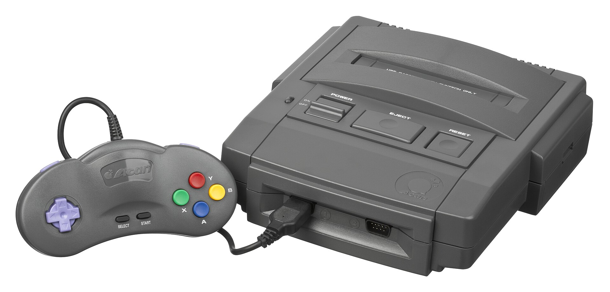
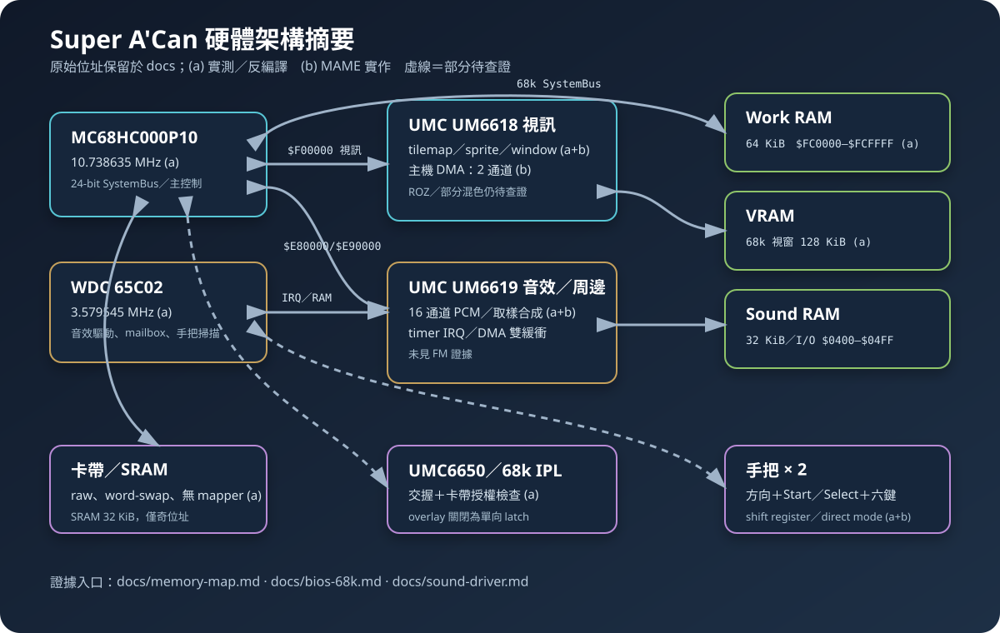
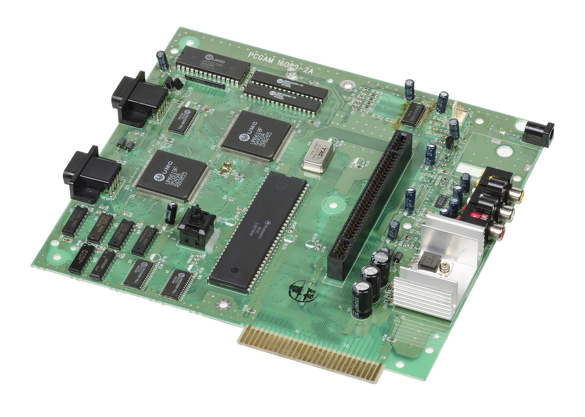

# Super A'Can（敦煌／F-16）研究知識庫



本專案整理台灣 1995 年家用遊戲主機 **Super A'Can** 的硬體、BIOS、卡帶格式、
Bcan 模擬器與遊戲音效驅動研究，作為後續模擬器與遊戲乾淨重製的可追溯基礎。
目前成果是研究文件與分析工具，**不是可直接遊玩的模擬器或遊戲發行包**。

> 上圖是實機與配件照片；攝影：Evan-Amos，公有領域。完整來源與授權紀錄見
> [硬體圖片說明](assets/hardware/README.md)。

## 研究與資產邊界

- 規格依證據分為 **(a) Bcan／BIOS／ROM 實測**、**(b) MAME 實作**、
  **(c) 維基與媒體報導**；互相衝突時以較高層級證據為準。
- `Bcan008b/`、ROM、BIOS、`Bcan.exe` 與 IDA 資料庫只供本機研究，已由
  `.gitignore` 排除，不屬於本庫可公開散布內容。
- 本庫不提供遊戲 ROM、BIOS 或原版美術、音樂與程式。使用者須自行取得合法研究輸入。
- 文件中的未驗證內容會標示「待查證」；模擬器內部測試通過不等於原機逐週期一致。

## 已確認的硬體輪廓



| 元件 | 目前結論 | 證據 |
|---|---|---|
| 主 CPU | Motorola `MC68HC000P10`，10.738635 MHz | 型號 (p)、時脈 (a) |
| 音效／輸入 CPU | WDC 65C02，3.579545 MHz | (a) Bcan 核心與遊戲驅動 |
| 視訊 | UMC UM6618，tilemap、sprite、window、DMA；部分 ROZ／混色仍待補證 | (a)+(b) |
| 音效／周邊 | UMC UM6619，16 通道 PCM／取樣式合成；未見 FM 證據 | (a)+(b) |
| 主記憶體 | 64 KiB Work RAM，`$FC0000–$FCFFFF` | (a) |
| 音效記憶體 | 32 KiB；65C02 I/O 位於 `$0400–$04FF` | (a)+(b) |
| 視訊記憶體 | 68k 可見視窗 128 KiB；`16000-2A` 板物理 256 KiB，UM6618 可驅動完整 17-bit word address；上半部 consumer 未定 | (a)+(p) |
| 卡帶 | raw binary、16-bit word-swap 向量表、無 mapper；支援雙部分卡帶 | (a) |

詳細位址與仍待查證的欄位，請以
[記憶體映射](docs/memory-map.md)及各研究文件為準；上圖是摘要，不取代原始位址證據。
各晶片可由主機板接線確認的範圍，另見
[板級證據方法與盤點](docs/hardware-evidence-method.md)。

### 實機主機板



此照片可辨認板上的 UM6618、UM6619 與 Motorola MC68HC000P10 等元件，但晶片外觀本身不證明
暫存器語意；功能結論仍以反編譯、ROM／BIOS 實測及 MAME 實作交叉驗證為準。

## 目前狀態

- 68k IPL、UMC6650 交握、卡帶授權區與跳轉流程已完成分析。
- Bcan 0.0.8b 的時脈、SystemBus、ROM／BIOS 載入、即時存檔標頭、金手指格式與
  安全停止機制已有可回查文件。
- 遊戲上傳的 65C02 音效驅動、68k→65C02 mailbox、IRQ ack、UM6619 PCM 與
  Speedy Dragon 第二音樂驅動已完成主要資料流分析。
- Linux 模擬器實作位於同層的獨立本機 repo `../superacan-emu/`；本庫只保存硬體與
  逆向證據，不把該實作狀態冒充為本庫交付物。

## 文件導航

- [68k IPL 分析](docs/bios-68k.md)
- [68k BIOS 完整控制流程與中斷向量](docs/bios-control-flow.md)
- [65C02 端 BIOS 取樣資料與開機流程](docs/bios-65c02.md)
- [BIOS 與 ROM 格式](docs/bios-rom-format.md)
- [正式軟體目錄與本地 ROM 對照](docs/software-catalog.md)
- [Bcan 模擬器逆向分析](docs/emulator-analysis.md)
- [記憶體映射與硬體暫存器](docs/memory-map.md)
- [硬體組成與逐晶片模擬實作參考](docs/hardware-implementation-sources.md)
- [逐晶片模擬實作指南](docs/chip-emulation-guide.md)
- [UM70C188 調色盤／RAMDAC 研究](docs/palette-dac.md)
- [F003 UM6618 pixel-mode producer](docs/f003-video-mode.md)
- [軟體模擬資料充分度評估](docs/emulation-readiness-assessment.md)
- [文件完整度複查與可補來源](docs/documentation-review.md)
- [遊戲音效驅動與通訊協定](docs/sound-driver.md)
- [硬體圖片來源與授權](assets/hardware/README.md)
- [工作歷程](WORKLOG.md)

## 分析工具

`tools/deswap.py` 轉換 ROM／BIOS 的 16-bit word-swap；`tools/rominfo.py` 顯示 ROM
大小、SHA-256、向量表與 `$2000` 授權區摘要。依本專案規則，分析只在 Docker 內執行：

```sh
docker run --rm --network none --memory 256m --cpus 1 --pids-limit 128 \
  -u "$(id -u):$(id -g)" -v "$PWD:/repo:ro" -w /repo \
  python:3.13-alpine python tools/rominfo.py "Bcan008b/ROMS/Boom Zoo (Taiwan).bin"
```

## 參考與非隸屬聲明

主要外部交叉驗證來源包括
[MAME Super A'Can driver](https://github.com/mamedev/mame/blob/master/src/mame/umc/supracan.cpp)、
[splash5/superacan-notes](https://github.com/splash5/superacan-notes)與
[Wikimedia Commons 的 Super A'Can 分類](https://commons.wikimedia.org/wiki/Category:Super_A%E2%80%99Can)。
本專案為獨立保存與研究工作，與敦煌科技、聯華電子、Bcan、MAME 或原遊戲權利人無隸屬關係。
