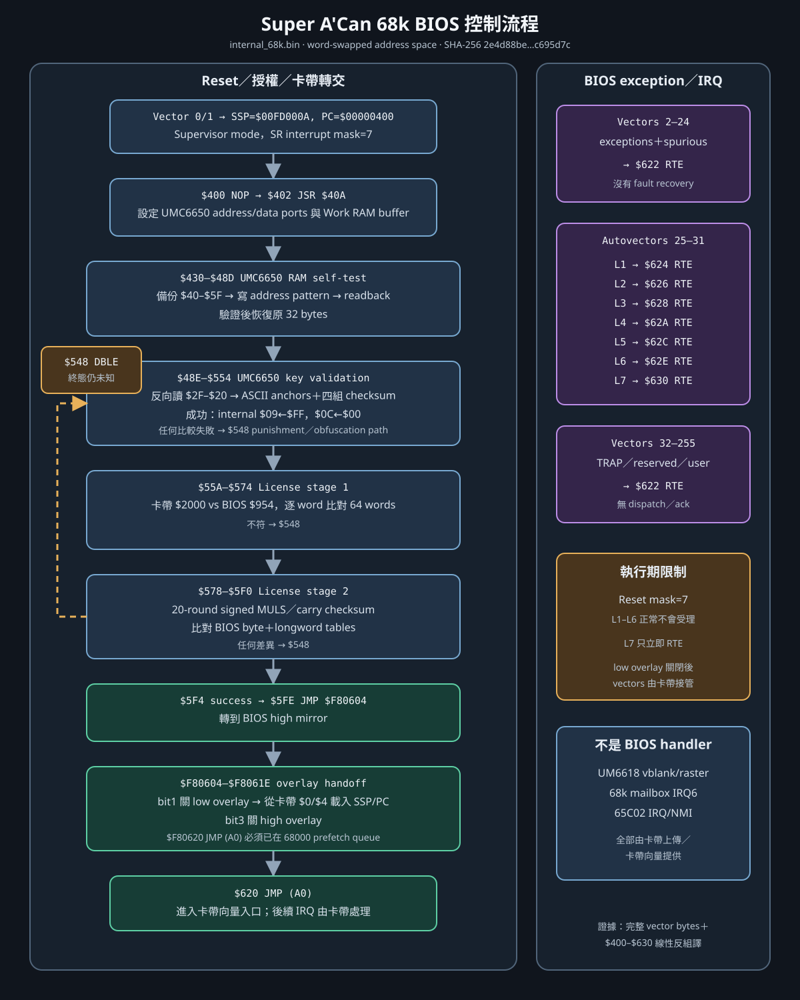

# Super A'Can 68k BIOS 完整控制流程與中斷向量

本文件解析 `internal_68k.bin` 的完整可執行區與 256-entry Motorola 68000 vector table。
輸入檔 SHA-256 為
`2e4d88bec69b5e7e4803368c233ce0d20f6dd107c5af0cfcc0089d310c695d7c`；流通檔先做
16-bit byte swap，再以 GNU Binutils `m68k-linux-gnu-objdump`（Debian bookworm 套件）按
`m68k:68000` 解碼。地址均為 word-swap 後的 BIOS offset／開機低區線性地址；高區 mirror
以 `$F80000 + offset` 表示。



## 1. 映像布局

| 範圍 | 內容 | 證據等級 |
|---|---|---|
| `$000–$3FF` | 256 個 32-bit 68000 vectors | 已證實：原始 bytes |
| `$400–$630` | 全部可執行 BIOS code，共 `$232` bytes | 已證實：完整線性反組譯 |
| `$632–$947` | `$FFFF` padding | 已證實：原始 bytes |
| `$948–$953` | `UMC 1994 (C)` | 已證實：原始 bytes |
| `$954–$9D3` | 128-byte 卡帶授權比對表 | 已證實：`$560` producer／`$570` consumer |
| `$9D4–$FFF` | 第二階段校驗表及填充 | 已證實有 `$578–$5F0` consumer；個別欄位未命名 |

`$400–$620` 是唯一正常 reset path；`$622–$630` 只有八條 `RTE`。映像內沒有初始化
UM6618、UM6619、VRAM、palette 或遊戲用 IRQ handler 的其他隱藏程式。

## 2. Reset 與主控制流程

### 2.1 Reset 入口 `$400`

68000 reset 由 vector 0/1 載入 SSP=`$00FD000A`、PC=`$00000400`，處理器進入 supervisor
mode 且 interrupt mask=7。`$400 NOP` 後，`$402 JSR $40A` 進入安全檢查。

`$406 JSR (SP)`、`$408 RTS` 不屬正常成功路徑。若早期 UM6650 RAM readback 失敗，
`$46E BNE $408` 會讓 `$408 RTS` 回到 `$406`，再把當時 `(SP)` 內容當函式位址呼叫。
這個 target 取決於尚未由 BIOS 初始化的 stack memory，因此只能標為**失敗／反逆向路徑，
確切效果未知**；模擬器不得把它當正常 callback。

### 2.2 UMC6650 RAM 測試 `$40A–$48D`

1. A0=`$EB0D03` address port、A1=`$EB0D01` data port、A2=`$FC0000` 暫存區。
2. 讀 `$E90B3C & 1`，若非零便回寫；之後流程穿插多個 constant write。這些寫入不改變
   已知玩家狀態，作用仍未知。
3. 從內部 address `$5F` 倒數到 `$40`，把原 32 bytes 備份到 Work RAM。
4. 逐地址寫入 address 本身，再讀回比對；任何不符在 `$46E` 走 `$408` failure path。
5. 將備份的 32 bytes 倒序寫回，恢復 UM6650 RAM 原狀。

這段同時證明 `$40–$5F` 是可讀寫 RAM，也證明 address/data port 的角色；MAME
`umc6650.cpp` 現有 offset 角色與此相反。

### 2.3 UMC6650 key 驗證 `$48E–$559`

1. `$48E` 令 D0=`$2F`，`$4A2–$4BC` 從 `$2F` 倒數到 `$20`，把 16-byte key 讀入
   `$FC0000+`。
2. `$4C0–$502` 計算 byte add、byte subtract、word add、word subtract 四組 checksum。
3. `$506–$51C` 檢查反向 buffer 中的 `UM`、`( `、`)C` anchors；`$520–$542` 比對四個
   checksum bytes。
4. `$532–$540` 先寫內部 `$09 ← $FF`；最後一個 checksum 通過後，`$54C–$554` 寫
   `$0C ← $00`。
5. 任一 key／checksum 失敗都轉 `$548 DBLE D4,$4FA`。它以當時 condition code 與 D4
   重入 checksum 中段，明顯是懲罰／混淆控制流；是否必然鎖死尚未做 invalid-key 動態實驗，
   因此不宣稱 fail-open 或 fail-closed。

### 2.4 卡帶授權 `$55A–$5F3`

第一階段：A3=`$2000`（卡帶）、A4=`$954`（BIOS table），`$56A–$574` 比對 64 words；
任何差異轉 `$548`。

第二階段 `$578–$5F0` 是巢狀 signed multiply／carry checksum：

- 外層 D0 低 word 從 19 起以 `DBF` 控制，共 20 輪；
- 每輪以 A2 保存卡帶 window 起點，D5 控制中／內層；
- `$5AE MULS (A3)+,D2`、`$5B6 ADD.L D2,D4`、`$5B8 ADDX.B D1,D3` 累加；
- `$5C6` 比對 BIOS byte table，`$5CC` 比對 longword table；任一失敗轉 `$548`；
- `$5E2–$5EC` 調整下一個 input window，直到 `$5F0` 外層結束。

這足以重建相同 validator；各 table byte 的人類語意不影響模擬器，無須推測命名。

### 2.5 Overlay 關閉與卡帶轉交 `$5F4–$620`

1. `$5F4` 把 `$0100` push 到舊 SSP；緊接著會載入卡帶 SSP，正常路徑沒有已知 consumer，
   暫列反逆向／殘留寫入。
2. `$5F8` 清 `$E90B3C`；`$5FE JMP $F80604` 切到 BIOS 高區 mirror 執行。
3. `$604–$610` 將 `$E9001C` bit1 設為 1，關閉低區 BIOS overlay。
4. `$616/$61A` 從現在已露出的卡帶 `$0/$4` 載入 SSP 與入口 A0。
5. `$61E` 寫回 bit1|bit3，關閉高區 BIOS overlay。
6. `$620 JMP (A0)` 進入卡帶入口。

步驟 5–6 具有重要的 68000 prefetch 可見性：執行 `$61E` 後，高區 `$F80620` 已映射為卡帶，
但 `$620 JMP (A0)` 必須由先前預取的 BIOS instruction 完成。使用真實 prefetch queue 的 Moira
oracle 能正確轉交；新 CPU core 必須建立「高區 overlay write 前已預取 `$620`」的回歸測試，
不可只在每條 instruction 執行時重新由目前 map 取 opcode。

## 3. 完整 exception／interrupt vector table

### 3.1 Vector 分組

| Vector | Offset | 68000 意義 | BIOS target | routine |
|---:|---:|---|---:|---|
| 0 | `$000` | Initial SSP | `$00FD000A` | reset state，不是 handler |
| 1 | `$004` | Initial PC | `$00000400` | reset 主流程 |
| 2–23 | `$008–$05F` | bus/address error、illegal、zero divide、CHK、TRAPV、privilege、trace、line A/F、reserved／uninitialized | `$00000622` | 單一 `RTE` |
| 24 | `$060` | spurious interrupt | `$00000622` | 單一 `RTE` |
| 25 | `$064` | level 1 autovector | `$00000624` | 單一 `RTE` |
| 26 | `$068` | level 2 autovector | `$00000626` | 單一 `RTE` |
| 27 | `$06C` | level 3 autovector | `$00000628` | 單一 `RTE` |
| 28 | `$070` | level 4 autovector | `$0000062A` | 單一 `RTE` |
| 29 | `$074` | level 5 autovector | `$0000062C` | 單一 `RTE` |
| 30 | `$078` | level 6 autovector | `$0000062E` | 單一 `RTE` |
| 31 | `$07C` | level 7 autovector | `$00000630` | 單一 `RTE` |
| 32–47 | `$080–$0BF` | `TRAP #0–#15` | `$00000622` | 單一 `RTE` |
| 48–255 | `$0C0–$3FF` | reserved／user interrupt vectors | `$00000622` | 單一 `RTE` |

### 3.2 Handler 實際內容

```text
$622  RTE   ; vectors 2–24、32–255
$624  RTE   ; level 1
$626  RTE   ; level 2
$628  RTE   ; level 3
$62A  RTE   ; level 4
$62C  RTE   ; level 5
$62E  RTE   ; level 6
$630  RTE   ; level 7
```

沒有 register save、status read、IRQ acknowledge、dispatch 或 peripheral service。level 1–7
使用不同地址只保留向量身分，行為完全相同。

### 3.3 執行期意義

- Reset 後 SR interrupt mask=7，level 1–6 在 IPL 正常流程被遮罩；level 7 即使進入也只 `RTE`。
- exception 指向 `RTE` 不代表可安全恢復。例如 illegal instruction 返回同一 PC 可能反覆觸發；
  這些是最小 stub，不是完整 fault recovery。
- BIOS 不會解除任何 UM6618／UM6619 IRQ。IPL 正常路徑也不啟用這些 device。
- `$610` 關低區 overlay 後，vector table 立即改為卡帶向量；遊戲執行期的 vblank、raster、
  mailbox 等 handler 全屬卡帶程式，不是 BIOS `$622–$630`。
- `internal_6502_1/2.bin` 是取樣資料，沒有 65C02 reset／NMI／IRQ vectors。65C02 handler 由
  各卡帶上傳，流程見 [sound-driver.md](sound-driver.md)，不可列入 BIOS interrupt routine。

## 4. 模擬器最小測試契約

1. word-swap 後 vector 0/1 必須是 `$00FD000A/$00000400`。
2. vectors 2–24、32–255 必須全部為 `$622`；vectors 25–31 依序為 `$624–$630`。
3. power-on SR mask=7；不得在 IPL 階段自行啟用週邊 IRQ。
4. 有效 key／授權卡帶必須依序命中 `$55A`、`$5F4`、`$F80604` 與卡帶 entry。
5. low overlay 在 bit1 寫入後切換；`$0/$4` 必須讀到卡帶 SSP／PC。
6. high overlay 在 bit3 寫入後切換，但已預取的 `$620 JMP (A0)` 必須完成。
7. 未授權 key／卡帶的 failure path 尚未定案；在動態實驗前只能安全停止並輸出 fault evidence，
   不可把推測的 fail-open／fail-closed 固化成相容性聲明。

## 5. 證據限制

本文件完整覆蓋目前這個 4096-byte BIOS dump 的 vector table 與所有可執行 bytes，但「完整解析」
不等於晶片級完整：UM6650 `$09/$0C` 外部 pin、`$E90B3C` 寫入目的、invalid-key `$548` 的
確切終態，以及其他可能 BIOS revision 仍未知。這些未知不影響有效 BIOS＋有效卡帶的正常轉交。
