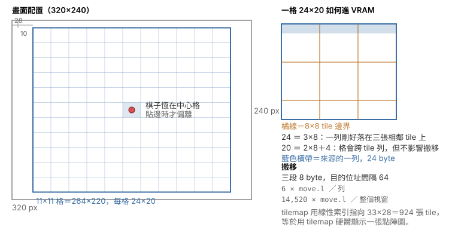
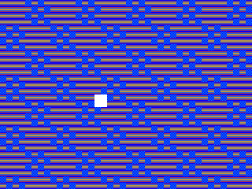
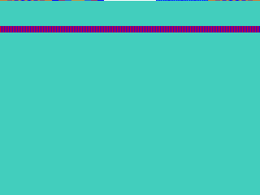
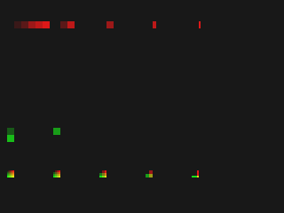
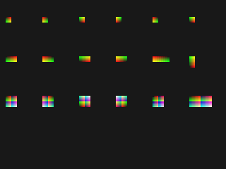

# 測試結果截圖說明

三顆自製卡帶各自要回答一個問題，截圖就是答案的載體。這一份記錄每一張圖是怎麼產生的、
該看哪裡、量到什麼數字，以及哪些圖因為含有原版美術而不進版控。

## 1. 共通流程

| 步驟 | 做法 |
|---|---|
| Bcan 端 | 以 GUI 載入卡帶（不吃命令列 ROM 參數），按 F8 存 `snap\` 的 320×240 framebuffer PNG |
| 本專案端 | `acan-headless --screenshot`／`--screenshot-dir`，輸出同樣是 320×240 |
| 比對 | 逐像素比，不比檔案位元組——兩邊 PNG 編碼器不同，檔案雜湊本來就不會一樣 |

比對只看像素雜湊與相異像素數。**不要拿顏色直方圖判斷**：位移類的差異會讓兩張圖內容相同、
直方圖幾乎一樣，卻是完全不同的畫面（`WORKLOG.md` 2026-09-01 有踩過的紀錄）。

## 2. 大富翁2 棋盤 demo（`homebrew/rich2demo/`）

### 2.1 畫面構成



畫面是原版的 11×11 地圖視窗：264×220，置於 320×240 畫面的 `(28, 10)`，由 tilemap 的
scroll X = −28、scroll Y = −10 達成。棋子恆在中心格，只有視窗被夾在 36×36 地圖邊界時才偏離。

A'Can 的 tile 是 8×8，而原版地圖圖磚是 24×20，高度不整除。所以整個視窗在寫進 VRAM 時
就排成 924 張 8×8 packed 8bpp tile，tilemap 用線性索引指過去——等於用 tilemap 硬體顯示
一張點陣圖。24 是 8 的倍數，來源每一列因此正好落在三張相鄰 tile 的同一列上。

### 2.2 三組截圖分別在證明什麼

| 截圖 | 產生方式 | 該看哪裡 | 結論 |
|---|---|---|---|
| 初始畫面 | 本專案跑 100 幀 | 台灣棋盤的道路、`?`／`$`／News 格、棋子在中心 | 圖磚索引、視窗原點、調色盤三者都對 |
| 與 rich2 參考圖對拍 | rich2 的 `RenderMapViewport` 產同一視窗 | 逐像素差 | 相異 **32**／58,080，全部落在棋子那 8×8 上 |
| 與 Bcan 對拍 | Bcan F8 存同一初始畫面 | 逐像素差 | 相異 **0**／76,800 |
| 移動序列 | 本專案跑 1200 幀、每 100 幀取一張，注入 4 次 A | 12 張中有 8 種相異畫面 | 擲骰、走格、視窗重新置中都成立 |
| Bcan 移動序列 | Bcan 內按 6 次 `z` | 7 張中有 3 種相異畫面 | 65C02 手把驅動在 Bcan 端有效 |

對拍 rich2 參考圖時**要先把參考圖做 5-bit 量化**（`v>>3` 再 `v<<3｜v>>2` 展開）。
A'Can 調色盤是 xBGR555，原版是 8-bit VGA；不量化的話 58,080 個像素會有 36,677 個「不同」，
全是量化誤差，看起來像整張圖都錯。

### 2.3 為什麼這幾張不進版控

rich2demo 的畫面是《大富翁2》的原版地圖圖磚與調色盤，屬於受版權保護的美術。
**截圖與 ROM 產物一律只留在本機**，`.gitignore` 已排除 `homebrew/*/build/`。
本節改以自繪示意圖＋量測數字承載結論；要看畫面請在本機自行建置重現。

### 2.4 在本機重現

```sh
# 1) 由 rich2 專案匯出素材（board.json / layers.json / maptiles.bin / palette.bin）
# 2) 組卡帶
python3 homebrew/rich2demo/build.py --assets <匯出目錄> \
    --auth-rom "Bcan008b/ROMS/Boom Zoo (Taiwan).bin"
# 3) 本專案端取圖
acan-headless --rom homebrew/rich2demo/build/rich2demo.bin --frames 1200 \
    --press "60:A,300:A,600:A" --screenshot-dir out --screenshot-every 100
```

Bcan 端把 `.bin` 複製進 `ROMS\`，用 `檔案(F)` → 第一項 → 輸入完整路徑載入，按 F8 取圖。

## 3. `$F001F0` bit 3（`homebrew/bit3probe/`）

同一顆卡帶每 300 幀切換 `$F001F0` 的 bit 3，backdrop 在兩個相位分別是綠與紅，
單看一張圖就能判斷相位。

| bit 3 = 0：tilemap 路徑 | bit 3 = 1：線性 bitmap 路徑 |
|---|---|
|  |  |
| 綠底，畫出 tile 圖樣，色彩來自 tile 資料 | 紅底，整片索引 200——那是 VRAM 的填值本身 |

左圖走 tilemap，右圖跳過 tilemap 與 tile 圖形，把 VRAM 當連續點陣圖逐像素讀。
右圖第 32–39 列的橫向條紋是 tilemap 所在的 `$2000–$27FF`：那段的高位元組是零、
因而透明，露出 backdrop。把 `$F00196` 由 `$0000` 改成 `$0800`，條紋會移到第 0–7 列，
正好是 `4 × $0800 ÷ 256`——這就是 bitmap 基底倍率的證據。公式見
[`$F001F0` 資料流](f003-video-mode.md) §7.3、§7.6。

兩張圖的內容全部由 `build.py` 生成（調色盤、tile、tilemap），不含任何原版素材。
本專案 renderer 產生的畫面與這兩張逐像素相同。

## 4. sprite 表欄位（`homebrew/spriteprobe/`）

每頁 24 筆 sprite 排成 4×6，每格只差一個欄位值。

| 第 1 頁：縮放與 mosaic | 第 2 頁：翻轉與多 tile |
|---|---|
|  |  |
| 第 0–1 列掃 `hscale`（寬 48→2）、第 2 列掃 `vscale`（高 24→3）、第 3 列掃 mosaic | 第 0 列翻轉、第 1 列翻轉配縮放、第 2 列 2×2 子 tile 表、第 3 列 ySize 索引 |

sprite 圖形是**解碼圖**：像素值 ＝ `x + 8y + 64t`，調色盤把 `x` 編進紅、`y` 編進綠、
tile 編號 `t` 編進藍。所以圖上每個像素都能反推它取樣自哪一張 tile 的哪一格，
不必從外框反推取樣函式。判讀方式與欄位表見 [sprite-format.md](sprite-format.md)。

兩頁共 48 個案例，Bcan 與本專案的畫面逐像素相同（相異 0／76,800）。

## 5. 判讀截圖時踩過的三個坑

1. **單色測試圖會把取樣錯誤藏起來。** sprite 探針第一版用純白圖形，外接矩形 24／24 全中，
   取樣卻整片是錯的——單色圖看不出 mosaic 正在把畫面切塊。要驗證取樣函式，
   測試圖必須讓每個來源像素可辨識。
2. **狀態標示的顏色不能與「什麼都沒畫」的顏色相同。** bit3 探針第一版的 backdrop 與
   bit3=0 的相位標示同為藍色，導致把兩個相位判反。
3. **位移類假說要用位置量測驗證，不能用整體統計量。** `$F00196` 的對照實驗一度被判為
   「沒有變化」，因為只比對顏色直方圖；兩張圖內容相同、只是位移，直方圖幾乎一樣。
