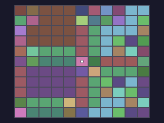
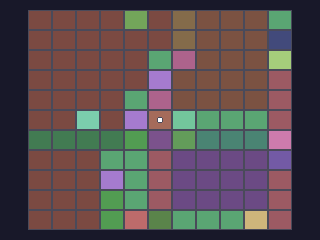
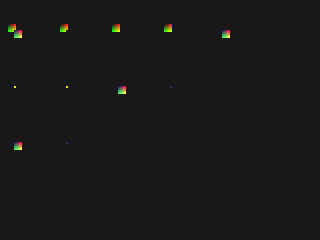
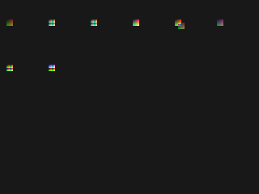
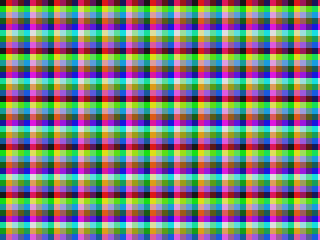
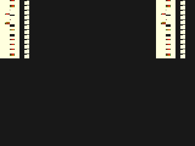

# 測試結果截圖說明

三顆自製卡帶各自要回答一個問題，截圖就是答案的載體。這一份記錄每一張圖是怎麼產生的、
該看哪裡、量到什麼數字，以及哪些圖因為含有原版美術而不進版控。

## 1. 共通流程

| 步驟 | 做法 |
|---|---|
| Bcan 端 | 以 GUI 載入卡帶（不吃命令列 ROM 參數），按 F8 存 `snap\` 的 320×240 framebuffer PNG |
| 本專案端 | `acan-headless --screenshot`／`--screenshot-dir`，輸出同樣是 320×240 |
| 比對 | 逐像素比，不比檔案位元組——兩邊 PNG 編碼器不同，檔案雜湊本來就不會一樣 |

比對只看像素雜湊與相異像素數。**不要拿顏色直方圖判斷**：位移類的差異會讓兩張圖內容相同、
直方圖幾乎一樣，卻是完全不同的畫面（`WORKLOG.md` 2026-09-01 有踩過的紀錄）。

## 2. 大富翁2 棋盤 demo（`homebrew/rich2demo/`）

### 2.1 兩種美術模式

`build.py --art` 決定畫面用什麼圖塊，兩者跑的是同一份程式與同一份棋盤資料：

| 模式 | 圖塊來源 | 截圖能不能進版控 |
|---|---|---|
| `original`（預設）| `PART1.PAK` 的 131 張原版圖磚＋`256.PAT` | 不行，畫面是原版美術 |
| `placeholder` | `build.py` 生成：131 種地形各一色，加一圈格線 | 可以，每個像素都是自己畫的 |

下面兩張是 `placeholder` 模式。棋盤版面仍然是原版的道路網——同一種地形連成色塊，
所以道路、街廓與水域的分佈讀得出來——但沒有任何一個像素來自原版美術。

| 初始畫面（第 100 幀）| 擲兩次骰之後（第 400 幀）|
|---|---|
|  |  |
| 棋子（白）在中心格，視窗以起始格為中心 | 視窗跟著棋子重新置中，看到棋盤的另一區 |

左圖與 Bcan 0.0.8b 跑同一顆映像**逐像素相同**（相異 0／76,800）。

### 2.2 畫面構成


畫面是原版的 11×11 地圖視窗：264×220，置於 320×240 畫面的 `(28, 10)`，由 tilemap 的
scroll X = −28、scroll Y = −10 達成。棋子恆在中心格，只有視窗被夾在 36×36 地圖邊界時才偏離。

A'Can 的 tile 是 8×8，而原版地圖圖磚是 24×20，高度不整除。所以整個視窗在寫進 VRAM 時
就排成 924 張 8×8 packed 8bpp tile，tilemap 用線性索引指過去——等於用 tilemap 硬體顯示
一張點陣圖。24 是 8 的倍數，來源每一列因此正好落在三張相鄰 tile 的同一列上。

### 2.3 三組截圖分別在證明什麼

| 截圖 | 產生方式 | 該看哪裡 | 結論 |
|---|---|---|---|
| 初始畫面 | 本專案跑 100 幀 | 台灣棋盤的道路、`?`／`$`／News 格、棋子在中心 | 圖磚索引、視窗原點、調色盤三者都對 |
| 與 rich2 參考圖對拍 | rich2 的 `RenderMapViewport` 產同一視窗 | 逐像素差 | 相異 **32**／58,080，全部落在棋子那 8×8 上 |
| 與 Bcan 對拍 | Bcan F8 存同一初始畫面 | 逐像素差 | 相異 **0**／76,800 |
| 移動序列 | 本專案跑 1200 幀、每 100 幀取一張，注入 4 次 A | 12 張中有 8 種相異畫面 | 擲骰、走格、視窗重新置中都成立 |
| Bcan 移動序列 | Bcan 內按 6 次 `z` | 7 張中有 3 種相異畫面 | 65C02 手把驅動在 Bcan 端有效 |

對拍 rich2 參考圖時**要先把參考圖做 5-bit 量化**（`v>>3` 再 `v<<3｜v>>2` 展開）。
A'Can 調色盤是 xBGR555，原版是 8-bit VGA；不量化的話 58,080 個像素會有 36,677 個「不同」，
全是量化誤差，看起來像整張圖都錯。

### 2.4 原版美術模式的截圖為什麼不進版控

`--art original` 的畫面是《大富翁2》的原版地圖圖磚與調色盤，屬於受版權保護的美術。
**該模式的截圖與所有 ROM 產物一律只留在本機**，`.gitignore` 已排除 `homebrew/*/build/`。
版控裡改放三樣可重跑的東西：`--art placeholder` 的截圖、自繪的版面示意圖，以及
`manifest.json`——它記下整條重現鏈（原版輸入 → 匯出素材 → 中間產物 → 卡帶映像）的
SHA-256。版權檔案本身不進版控，雜湊可以：任何人拿自己的合法原版重跑，`build.py`
會直接核對出位元是否相同。

### 2.5 在本機重現

```sh
# 1) 匯出素材。Go 的 internal 套件不能跨模組 import，所以把 rich2 複製成暫時模組再跑。
mkdir -p /tmp/r2mod/cmd/dump
cp ~/cht/rich2/{go.mod,go.sum} /tmp/r2mod/
cp -r ~/cht/rich2/internal /tmp/r2mod/internal
cp homebrew/rich2demo/export/main.go /tmp/r2mod/cmd/dump/main.go
cd /tmp/r2mod && go run ./cmd/dump <RICH2 目錄> /tmp/r2out SAVE_2.DSK

# 2) 組卡帶。有 manifest.json 時會自動核對雜湊，不符就以非零離開。
python3 homebrew/rich2demo/build.py --assets /tmp/r2out \
    --auth-rom "Bcan008b/ROMS/Boom Zoo (Taiwan).bin" \
    --orig <RICH2 目錄> --art placeholder

# 3) 本專案端取圖
acan-headless --rom homebrew/rich2demo/build/rich2demo-placeholder.bin --frames 600 \
    --press "60:A,300:A" --screenshot-dir out --screenshot-every 100
```

Bcan 端把 `.bin` 複製進 `ROMS\`，用 `檔案(F)` → 第一項 → 輸入完整路徑載入，按 F8 取圖。

## 3. `$F001F0` bit 3（`homebrew/bit3probe/`）

同一顆卡帶每 300 幀切換 `$F001F0` 的 bit 3，backdrop 在兩個相位分別是綠與紅，
單看一張圖就能判斷相位。

| bit 3 = 0：tilemap 路徑 | bit 3 = 1：線性 bitmap 路徑 |
|---|---|
|  |  |
| 綠底，畫出 tile 圖樣，色彩來自 tile 資料 | 紅底，整片索引 200——那是 VRAM 的填值本身 |

左圖走 tilemap，右圖跳過 tilemap 與 tile 圖形，把 VRAM 當連續點陣圖逐像素讀。
右圖第 32–39 列的橫向條紋是 tilemap 所在的 `$2000–$27FF`：那段的高位元組是零、
因而透明，露出 backdrop。把 `$F00196` 由 `$0000` 改成 `$0800`，條紋會移到第 0–7 列，
正好是 `4 × $0800 ÷ 256`——這就是 bitmap 基底倍率的證據。公式見
[`$F001F0` 資料流](f003-video-mode.md) §7.3、§7.6。

兩張圖的內容全部由 `build.py` 生成（調色盤、tile、tilemap），不含任何原版素材。
本專案 renderer 產生的畫面與這兩張逐像素相同。

## 4. sprite 表欄位（`homebrew/spriteprobe/`）

sprite 排成 4×6 網格，每格只差一個欄位值。

| 第 1 頁：縮放與 mosaic | 第 2 頁：翻轉與多 tile |
|---|---|
|  |  |
| 第 0–1 列掃 `hscale`（寬 48→2）、第 2 列掃 `vscale`（高 24→3）、第 3 列掃 mosaic | 第 0 列翻轉、第 1 列翻轉配縮放、第 2 列 2×2 子 tile 表、第 3 列 ySize 索引 |

| 第 3 頁：mask 模式 | 第 4 頁：mask=1 的半透明 |
|---|---|
|  |  |
| 16 格是 A×B 兩個 sprite 的 mask 模式組合，A 在 (0,0)、B 偏移 (6,6) | 整頁沒有寫遮罩的 sprite，於是 mask=1 走另一條路徑，疊出可辨識的混色 |

第 3 頁要看的是**哪一個 sprite 留在畫面上**，不是形狀。B 偏移 6 像素，所以兩者只重疊
右下角 2×2；`maskA=1、maskB=2` 那一格只剩那 4 個像素，正好證明遮罩是整幀畫完才結算的
——寫遮罩的 B 排在 A 後面，A 仍然畫得出來。

第 4 頁要看的是**顏色**。疊在不透明 sprite 上的半透明 sprite，輸出的是兩者調色盤索引
相加後的顏色；疊在背景上的則與背景逐通道取平均。兩條分支的公式見
[sprite-format.md](sprite-format.md) §5。

sprite 圖形是**解碼圖**：像素值 ＝ `x + 8y + 64t`，調色盤把 `x` 編進紅、`y` 編進綠、
tile 編號 `t` 編進藍。所以圖上每個像素都能反推它取樣自哪一張 tile 的哪一格，
不必從外框反推取樣函式。判讀方式與欄位表見 [sprite-format.md](sprite-format.md)。

四頁共 87 個案例，Bcan 與本專案的畫面逐像素相同（每頁相異 0／76,800）。

## 5. mosaic 與主機 DMA（`homebrew/mosaicprobe/`、`homebrew/dmaprobe/`）

| mosaic：一般圖層，欄位 5 | DMA：12 個 control 值 |
|---|---|
|  |  |
| 塊大小是 6（欄位值 + 1），不是 32（`2^5`）。畫面鋪的是 16 像素週期的解碼圖樣，塊邊界直接看得出來 | 每一列是一個 control 值：左邊四格是目的區（事前填成索引 255），第六格是搬完後讀回的六個 DMA 暫存器 |

mosaic 那張要量的是**塊大小與塊原點**：`floor(d/6)×6` 與 `d & ~31` 在同一張圖上差
75,540 個像素，不需要細看就能分辨，但要下結論仍得把兩個模型的不符數都算出來。

DMA 那張的每一列可以逐 byte 讀出「搬了幾個單位、往哪個方向、暫存器停在哪裡」。
目的位址從 256 byte 區塊的正中央開始，所以遞減方向的案例往左長、遞增往右長，
一眼就能分辨。畫面右側那一欄在兩個模擬器上不同——Bcan 對 DMA 暫存器的讀取回 0，
本專案回實際值（[host-dma.md](host-dma.md) §5）。

## 6. 判讀截圖時踩過的五個坑

1. **單色測試圖會把取樣錯誤藏起來。** sprite 探針第一版用純白圖形，外接矩形 24／24 全中，
   取樣卻整片是錯的——單色圖看不出 mosaic 正在把畫面切塊。要驗證取樣函式，
   測試圖必須讓每個來源像素可辨識。
2. **狀態標示的顏色不能與「什麼都沒畫」的顏色相同。** bit3 探針第一版的 backdrop 與
   bit3=0 的相位標示同為藍色，導致把兩個相位判反。
3. **位移類假說要用位置量測驗證，不能用整體統計量。** `$F00196` 的對照實驗一度被判為
   「沒有變化」，因為只比對顏色直方圖；兩張圖內容相同、只是位移，直方圖幾乎一樣。
4. **解碼圖的反查表要排除背景色。** sprite 探針第 3 頁的調色盤索引 0 同時是 backdrop
   與 tile 0 的第一個像素，把索引 0 收進反查表，整片背景就被讀成「tile 0 到處都在」，
   16 格因此全部判成相同。排除索引 0 之後才看得到其中兩格的差異。
5. **「兩邊相同」要有負對照才算數。** 第 4 頁的混色公式與截圖差 0 個像素，但那句話單獨
   沒有意義——同一張圖換成「不透明」或「一律丟棄」的模型分別差 446、445 個像素，
   才知道那個 0 不是恆真。
